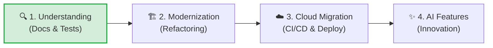
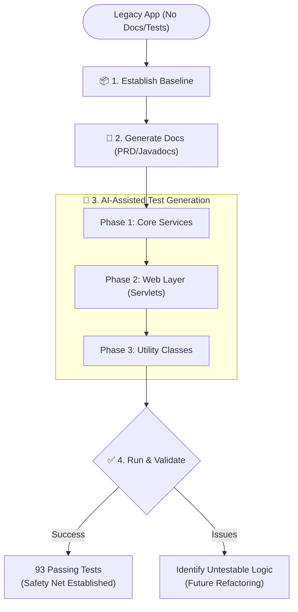

# The new way of developing Apps: Utilising AI (Gemini CLI) in modernizing legacy applications - Chapter 1: Generating Documentation and Tests

In today's fast-paced digital landscape, the pressure to adopt Cloud-native architectures and integrate AI capabilities is higher than ever. However, many organisations find themselves tethered to the ground by "legacy" applications. These systems, while critical to the business, often lack proper documentation, have little to no test coverage, and are built on architectural patterns that make Cloud migration and AI integration a daunting, risky, and expensive endeavour.

## The Modernization Challenge

Legacy applications often become "black boxes." The original developers might have moved on, and the institutional knowledge has faded. Attempting to move these applications to the Cloud or "bolt-on" AI features without a deep understanding of their inner workings is a recipe for regression and failure. The sheer effort required to manually document and test these systems before modernization can take months or even years.

## AI to the Rescue: Enter Gemini CLI

This is where AI, and specifically **Gemini CLI**, changes the game. Gemini CLI isn't just a code generator; it's an intelligent partner that can explore, understand, and document existing codebases with incredible speed and precision. It allows us to bridge the gap between legacy constraints and modern possibilities.

## The Modernization Journey

Modernizing an application is not a single leap; it's a journey. With Gemini CLI, we follow a structured path:

1.  **Understanding the Legacy:** Automatically generating documentation and tests to establish a baseline.
2.  **Architectural Modernization:** Refactoring the code into modern patterns (like Microservices or Serverless) to make it Cloud-ready.
3.  **Cloud Migration:** Leveraging AI to assist in containerization, CI/CD setup, and deployment to the Cloud.
4.  **AI Feature Development:** Once the application is modern and scalable, we can easily build and integrate new AI capabilities.

This blog post covers **Chapter 1: Understanding the Legacy**.

## Project Walkthrough: `legacy-java-docs`

In this project, we took a baseline legacy Java web application (a shopping cart) that came with zero documentation and no automated tests.

### 1. Establishing the Baseline

We started with a "clean" clone of the legacy repository. The code was functional but opaque. To a developer tasked with modernizing this, it represented a significant risk.

### 2. Generating Documentation with Gemini CLI

Using Gemini CLI, we were able to quickly generate a **Product Requirements Document (PRD)** and **Javadocs**. By pointing the agent at the source code, it inferred the business logic, user flows, and technical dependencies, creating a human-readable roadmap of what the application actually does.

**Example Prompts:**
> "Review the entire codebase and generate a comprehensive Product Requirements Document (PRD) explaining the core features, user roles, and data models of this shopping cart application."
> 
> "Generate comprehensive Javadocs for all classes in the `com.shashi.service` and `com.shashi.beans` packages. Ensure each method has descriptive `@param` and `@return` tags based on an analysis of its underlying business logic."

### 3. Automated Test Generation

The most critical step was creating a safety net. We tasked Gemini CLI with generating unit and integration tests for all services and servlets. 

The process was iterative:
-   **Phase 1 (Services):** Gemini CLI generated 67 tests for the core service layer (UserService, ProductService, etc.).
-   **Phase 2 (Web Layer):** It then moved to the Servlet layer, ensuring the web interfaces were correctly handling requests.
-   **Phase 3 (Utilities):** Finally, it covered utility classes like `IDUtil` and `MailMessage`.

### 4. Running and Validating Tests

We didn't just generate code; we ran it. Gemini CLI helped debug and refine the tests until we achieved a total of **93 passing tests**. 

This process also highlighted "untestable" logic—tightly coupled code that requires refactoring. This is invaluable information for the next stage of modernization.

## Conclusion: A New Era of Application Development

AI, specifically through tools like Gemini CLI, is transforming how we approach software engineering. App modernization is no longer a manual, error-prone chore. We can now move faster, with greater safety and security, while maintaining the integrity of existing business logic.

By establishing a documented and tested baseline, we've turned a legacy liability into a modern asset, ready for the next chapters of our journey: Cloud adoption and AI innovation.

---
*Stay tuned for Chapter 2, where we will dive into refactoring this baseline for the Cloud!*
toring this baseline for the Cloud!*
