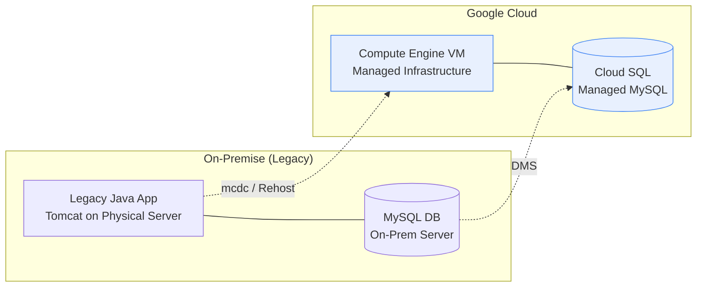

# The new way of developing Apps: Utilising AI (Gemini CLI) in modernizing legacy applications - Chapter 2: The Lift-and-Shift Journey to Google Cloud

In [Chapter 1](./chapter1.md), we laid the groundwork by using **Gemini CLI** to understand our legacy "black box" application. We generated documentation (PRDs, Javadocs) and established a safety net of over 90 automated tests. With a clear understanding of the application's inner workings, we are now ready to take the first physical step of our journey: **Cloud Migration**.

## The Modernization Paradox: Why Lift-and-Shift?

When faced with a legacy monolith, the temptation is often to jump straight into a full microservices refactor. However, organizations frequently face the "Modernization Paradox": you need the agility of the cloud to refactor effectively, but you can't get to the cloud because the refactor is too complex and risky.

The challenges are real:
- **Knowledge Gaps:** The original architects are gone.
- **Operational Risk:** Changing architecture and infrastructure simultaneously increases the surface area for failure.
- **Time Pressure:** On-premise hardware might be at its end-of-life, or scaling might be urgently required.

To mitigate these risks, we chose a pragmatic first step: **The Lift-and-Shift (Rehosting)**. We move the application to managed infrastructure in Google Cloud without changing its core architecture.

## Strategy: Managed Infrastructure

Our goal is to trade our self-managed, on-premise headaches for Google Cloud’s managed excellence.



## Execution: Discovery, Assessment, and Migration

Our approach involves two parallel streams: infrastructure assessment and code modernization analysis.

### 1. Infrastructure Discovery with Migration Center (mcdc)

Before moving anything, we need an inventory. We used the **Migration Center Discovery Client (mcdc)** to perform a deep assessment of our legacy environment.

```bash
# Download and setup mcdc
curl -O "https://mcdc-release.storage.googleapis.com/$(curl -s https://mcdc-release.storage.googleapis.com/latest)/mcdc"
chmod +x mcdc

# Run guest discovery to collect OS and application data
sudo ./mcdc-linux-collect.sh

# Export data to Migration Center for analysis
./mcdc export mc --project $PROJECT_ID
```

This tool generates a comprehensive report (like `modjava_mcdc.html`) that identifies dependencies, OS versions, and right-sizing recommendations for our new VM.

### 2. Code Modernization Analysis with codmod

While `mcdc` looks at the infrastructure, **codmod** looks at the *code*. It's a powerful tool designed to analyze legacy Java applications and suggest specific modernization "intents."

We used `codmod` to analyze our shopping cart application, focusing on the `JAVA_LEGACY_TO_MODERN` intent. This helped us understand the complexity of our codebase and estimated the effort required for a full modernization.

```bash
# Setting up codmod
./codmod config set project $PROJECT_ID
./codmod config set region $REGION

# Generate a modernization report
./codmod create -c ../shopping-cart/ -o modjava_codmod.html \
  --intent JAVA_LEGACY_TO_MODERN
```

The report generated by `codmod` provides a roadmap for future chapters, identifying deprecated libraries, EJB usage, or outdated Servlet patterns that will need attention when we move beyond the lift-and-shift. It effectively bridges the gap between "running on a VM" and "becoming a modern microservice."

### 3. High-Fidelity Database Migration with DMS

Migrating the database is often the scariest part of any cloud journey. For our on-premise MySQL backend, we used **Google Cloud Database Migration Service (DMS)**. DMS provides "full-fidelity" migration, meaning it seamlessly transfers not just the data, but also the schema, triggers, functions, and metadata.

The process involves establishing a secure connection between the on-premise environment and Google Cloud, followed by a continuous data sync. Here is how we orchestrated the migration:

**Step 1: Source Preparation**
First, we created a specialized `migrator` user on our source on-premise database. This grants DMS the necessary permissions to read data and the binary replication logs:

```sql
-- Create a migrator user with necessary permissions for DMS
CREATE USER 'migrator'@'%' IDENTIFIED BY 'PASSWORD';
GRANT SELECT, SHOW VIEW, TRIGGER, REPLICATION SLAVE, REPLICATION CLIENT, RELOAD, EXECUTE ON *.* TO 'migrator'@'%';
FLUSH PRIVILEGES;
```

**Step 2: Connection Profiles and Destination Setup**
In the Google Cloud Console, we defined a Source Connection Profile pointing to our on-premise MySQL server using the `migrator` credentials. We then created a Migration Job, which automatically provisioned our destination **Cloud SQL for MySQL** instance configured with our desired region and machine tier.

**Step 3: Continuous Replication (CDC) and Cutover**
DMS performed an initial snapshot of the on-premise data and then used Change Data Capture (CDC) to continuously replicate any new transactions to Cloud SQL. This continuous sync allowed us to safely test the new Cloud SQL instance in the background while the legacy app remained live. 

When we were ready for the final cutover, we stopped the on-premise application to halt new writes, let DMS drain the final in-flight transactions, and then promoted the Cloud SQL instance to be the new primary database. This approach ensured virtually zero data loss and minimized application downtime.

### 4. Application Re-hosting: From On-Prem to GCE

Once the database was migrated to **Cloud SQL**, we performed the application migration. This wasn't just a simple copy-paste; it involved re-configuring the application to talk to its new cloud-based database.

**The Migration Workflow:**

1.  **Configure Cloud SQL:** We used scripts (like `setup_gcp_resources.sh`) to provision the Cloud SQL instance, create the database, and set up the application user.
2.  **Update Application Config:** We modified `src/application.properties` in the legacy project to point to the new Cloud SQL IP and credentials.
3.  **Build and Deploy:**
    ```bash
    # Rebuild the legacy WAR with new database settings
    mvn install
    
    # Deploy to Tomcat on the GCE VM
    sudo cp target/shopping-cart-0.0.1-SNAPSHOT.war /usr/local/tomcat/webapps/ROOT.war
    sudo systemctl restart tomcat
    ```
4.  **Decommission Legacy:** Once validated, we stopped the on-prem services:
    ```bash
    sudo systemctl stop mysqld
    sudo systemctl disable mysqld
    ```

## The Benefits of a "Simple" Approach

Even without changing a single line of application code, we've realized massive benefits:

1.  **Security:** Integration with Cloud IAM and VPC service controls provides a perimeter that on-prem environments often lack.
2.  **Reliability:** Cloud SQL handles automated backups, patching, and high availability. GCE offers auto-healing for VMs.
3.  **Operational Excellence:** With Cloud Logging and Monitoring (formerly Stackdriver), we have instant visibility into logs and performance metrics that were previously buried in server files.
4.  **Cost & Performance:** We can right-size our instances based on the data from `mcdc`, ensuring we only pay for what we need while benefiting from Google’s high-performance network.

## Summary of the Cloud Migration

*   **Lack of Inventory:** Resolved using **Migration Center (mcdc)**, providing full visibility into application and infrastructure dependencies.
*   **Risky Database Migration:** Managed via **Database Migration Service (DMS)**, ensuring high-fidelity data transfer with minimal downtime.
*   **Operational Overhead:** Addressed by moving to **GCE & Cloud SQL**, leveraging managed patching, automated backups, and seamless scaling.
*   **Security Concerns:** Hardened using **Google Cloud Networking & IAM**, establishing an enterprise-grade security posture and identity-based access control.

## The Next Step: Autonomous Modernization

While this initial cloud migration got us to the cloud, our application is still a monolith. It's "Cloud-Ready," but not yet "Cloud-Native." 

In **Chapter 3**, we will return to our secret weapon. We will unleash the **Gemini CLI agent** in **Autonomous Mode** to take this GCE/CloudSQL baseline and transform it into a modern, containerized architecture using Cloud Run and GKE.

---
*Stay tuned for Chapter 3: Using AI to Autonomously Modernize to the Cloud!*