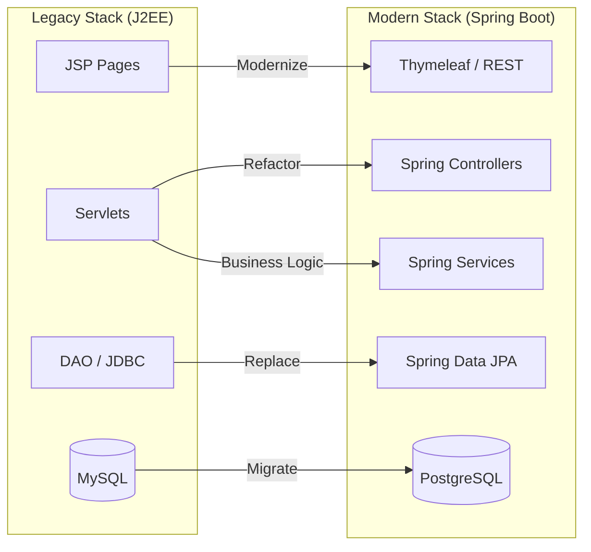
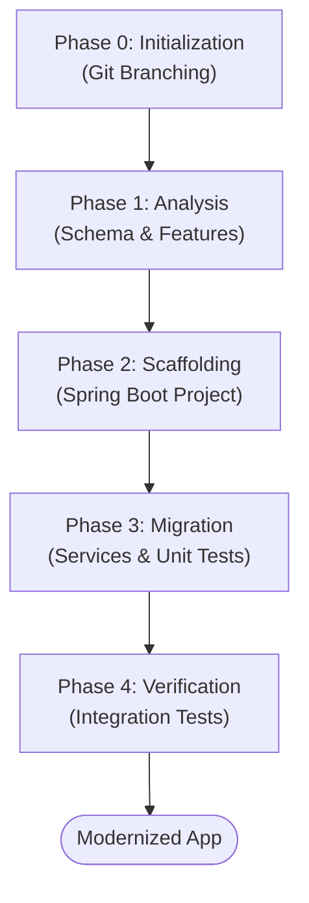
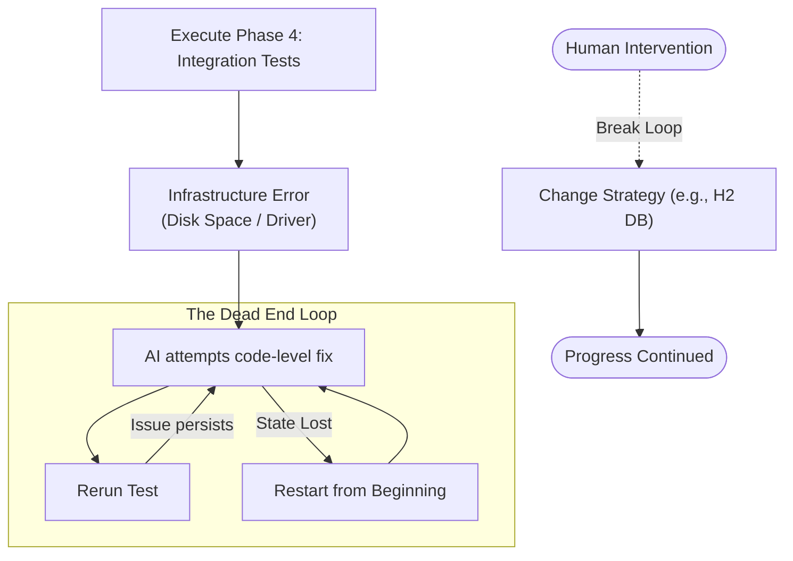

# The new way of developing Apps: Utilising AI (Gemini CLI) in modernizing legacy applications - Chapter 3: The Autonomous Rewrite Experiment

In our journey so far, we established a safety net of documentation and automated tests ([Chapter 1](./chapter1.md)) and successfully migrated our legacy monolith to Google Cloud using a Lift-and-Shift approach ([Chapter 2](./chapter2.md)). While the application is now hosted on modern managed infrastructure, the code itself remains tethered to legacy J2EE paradigms.

In this chapter, we push the boundaries. We experiment with the capabilities of the **Gemini CLI** agent in _autonomously_ rewriting the application code and modernizing its architecture. While architectural modernization brings immense benefits, like cloud-native agility and AI readiness, it also introduces complex challenges, such as untangling tightly coupled legacy logic.

**Spoiler alert: Our findings conclude that while the AI's generative power is staggering, fully autonomous modernization isn't quite a reality yet. A senior "human-in-the-loop" remains absolutely essential to guide the process and navigate inevitable roadblocks.**

## Why Modernize the Code? Benefits & Challenges

Moving beyond a simple Lift-and-Shift to a fully modernized application architecture unlocks profound advantages, but it comes with significant hurdles. The goal is to move from a rigid, monolithic stack to a flexible, cloud-native foundation.

### Benefits of Modern Application Architecture

- **Agility & Faster Time-to-Market:** Modern frameworks like Spring Boot provide rapid development capabilities, allowing teams to ship features faster.
- **Cloud-Native Readiness:** A Spring Boot backend is perfectly suited for containerization (Docker) and deployment on modern platforms like Google Cloud Run.
- **Enhanced Security:** Replacing outdated J2EE configurations with Spring Security provides robust, modern defense mechanisms.
- **Future-Proofing for AI:** By decoupling the layers through RESTful APIs, it becomes exponentially easier to integrate intelligent AI microservices.

### Challenges in Architecture & Code Modernization

- **Tangled Business Logic:** Legacy applications often suffer from tight coupling, where business rules are mixed with UI rendering (JSP) and database access.
- **State Management:** Transitioning from heavy server-side session state to stateless, token-based authentication requires a fundamental shift in logic.
- **Database Migrations:** Moving from MySQL to PostgreSQL involves refactoring SQL dialects, constraints, and data types.

## The Experiment: Letting AI Take the Wheel

Our approach was simple yet ambitious: define a strong persona for the Gemini CLI agent, outline a phased plan, and step back. We tasked Gemini CLI to leverage the assessments from Migration Center and `codmod` to modernize the app autonomously.

As defined in our `GEMINI-phase2.md` instruction file, we gave the agent the persona of a **World-Class Senior Java Engineer**. We instructed it to follow a test-driven path, pausing only at major phase gates. The intended approach was to see if the AI could navigate the entire rewrite with little to no human interaction.

## Reality Check: Where Autonomous AI Hits a Wall

Initially, the agent performed remarkably well-scaffolding the project and migrating core services with ease. However, as the complexity increased in the integration testing phase, the illusion of full autonomy began to crack.

### Key Scenarios of Agent "Dead Ends":

1.  **The Infrastructure Blind Spot:**
    When Selenium tests failed due to a full disk on the host machine, the agent attempted to "fix" the Java code rather than identifying the infrastructure constraint. It entered a loop of futile refactors.

2.  **Contextual Amnesia:**
    As sessions grew long, the agent struggled to maintain state. It would frequently "forget" a previous fix and re-introduce the same bug, leading to a frustrating "three steps forward, two steps back" pattern.

3.  **The Cost of "Trial and Error":**
    Without human guidance, the agent's autonomous debugging became computationally expensive. It consumed over 42 million tokens thumping against the same wall before a human intervened to suggest a simpler strategy (using an H2 database for testing).

## Conclusion: The Crucial Need for a "Senior Human-in-the-Loop"

Our Phase 2 experiment yielded a definitive conclusion: **Gemini CLI, or any coding agent currently on the market, does not yet possess the capability to autonomously rewrite a complex legacy codebase from start to finish.**

While AI is incredibly powerful at scaffolding and generating boilerplate, it lacks the high-level intuition required to navigate cascading architectural failures and infrastructure limitations.

The human element is not just needed; it is the most crucial part of the task. A senior engineer acting as a "pilot" is required to guide the architecture, provide strategic checkpoints, and make pragmatic trade-offs.

And that is exactly what awaits us in the next chapter. In **Chapter 4**, we move away from the "autonomous" experiment and demonstrate the true power of **Assisted Migration**-working collaboratively _with_ the Gemini CLI agent to achieve our modernization objectives.
