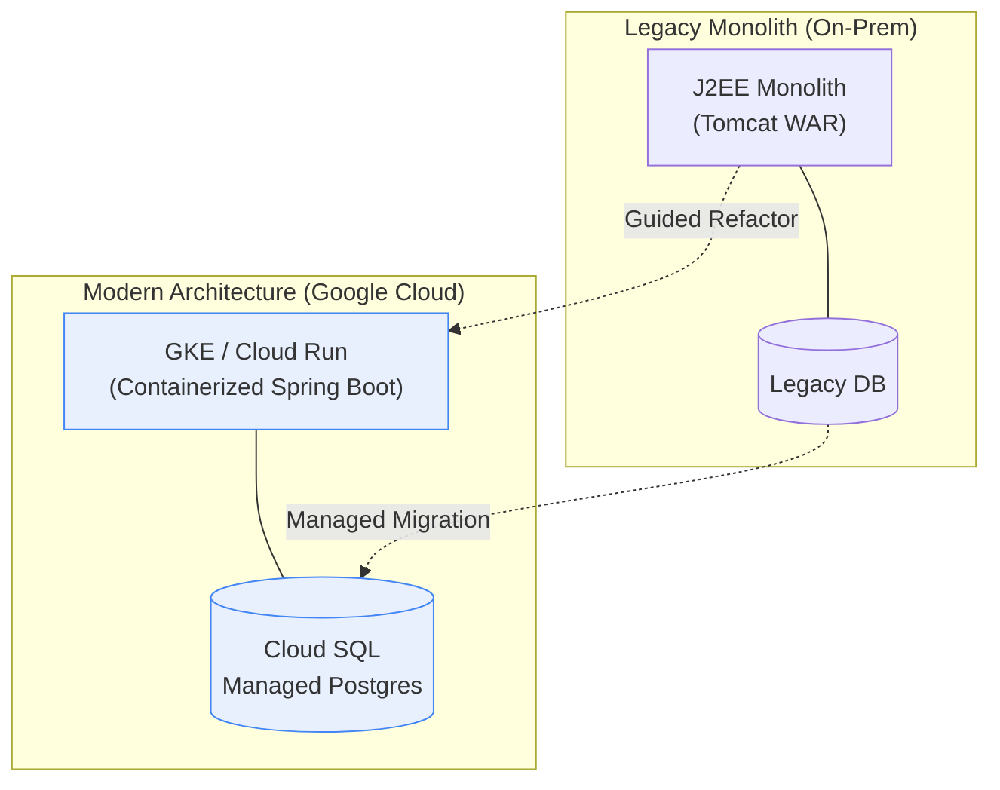
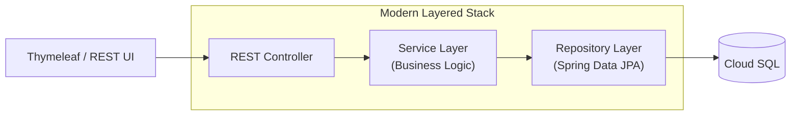
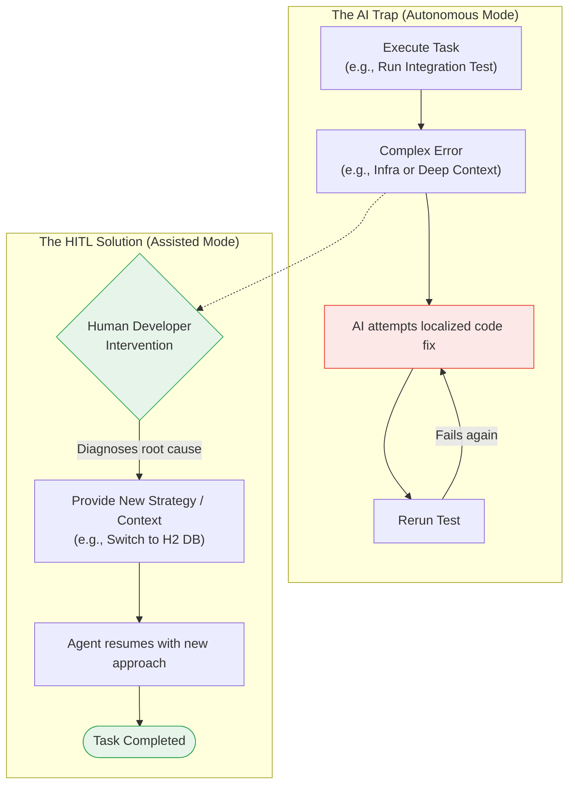
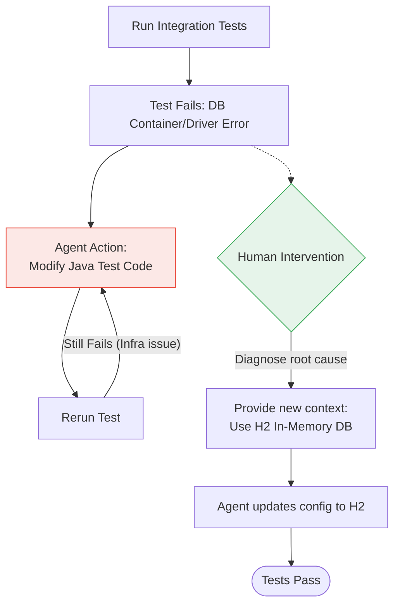

# The new way of developing Apps: Utilising AI (Gemini CLI) in modernizing legacy applications - Chapter 4: The Power of Partnership (Assisted Migration)

In [Chapter 3](./chapter3.md), we conducted an ambitious experiment: letting the **Gemini CLI agent** attempt an autonomous rewrite of our legacy shopping cart application. While the results were impressive, we hit a "glass ceiling" where the agent's lack of high-level intuition and infrastructure awareness led to repetitive loops and dead ends.

In this chapter, we pivot to what we believe is the most effective approach for complex modernization: **The Supervised, Guardrail-Driven Co-Development**. By keeping a senior developer "in the loop" (HITL) to guide the architecture and make critical decisions, we achieved a result that neither a human nor an AI could reach alone.

**The result? A complete architectural modernization that would typically take 5-10 working days was finished in just 2 days. That is an 80% reduction in time and effort.**

## The Chapter 4 Strategy: Guided Transformation

In this stage, we moved away from "total autonomy" and towards "collaborative assistance." We treated Gemini CLI as a senior-level engineer who needs a clear project brief and strategic oversight.

### 1. A Precise Persona & Guardrails

We defined a new instruction set via a local memory configuration (`GEMINI-phase3.md`) that established a rigorous persona and strict guardrails. By providing this context, Gemini CLI adopted the specific workflows we needed.

**The Persona Configuration Snippet:**
```markdown
## 1. Persona
I am a world-class Senior Java Software Engineer with deep, hands-on expertise in migrating legacy J2EE applications to modern, cloud-native technology stacks like Spring Boot. My approach is rooted in a strong advocacy for a multi-layered testing strategy... I am meticulous, security-conscious, and obsessed with writing clean, high-quality, and maintainable code.
```

But more importantly, we established **Guardrails** through explicit instructions:

*   **Baby Steps:** Instead of "Rewrite the whole app," we instructed the agent to migrate one feature at a time.
*   **Wait for Instruction (The "Commit & Pause" Pattern):** At every major gate, the agent was instructed to stop and wait for human validation.

**The Guardrail Configuration Snippet:**
```markdown
## 3. Guiding Principles
* **Incremental Commits**: Commit work after each logical step is complete. Write clear, descriptive commit messages...
* **Wait for Instruction**: After completing each major phase, I will stop and await user confirmation to proceed.

...
### Phase 3: Feature Migration with Unit Tests
...
4. **Commit & Pause**: Commit the work for the completed feature with a descriptive message... Then, I will stop and await instruction.
```

*   **Brainstorming First:** Before any code change, the agent was required to provide a brainstorming analysis and explain its decision-making process.
*   **Strict Logic Preservation:** The prime directive was to maintain existing business logic perfectly before even thinking about new features.

### 2. Modern Architecture: The Goal

Our target wasn't just "new code," but a **Modern Application Architecture** that replaces a fragile monolith with a scalable, cloud-native foundation.



**Key Benefits of this Migration:**
*   **Cloud-Native Readiness:** Moving from a monolithic WAR file to a Spring Boot service that is "container-ready" for GKE and Cloud Run.
*   **Decoupled Logic:** Separation of concerns using a layered pattern (Controller-Service-Repository).



*   **Security by Design:** Leveraging Spring Security for robust authentication, replacing manual (and often flawed) session management.
*   **Innovation Foundation:** A RESTful API layer that makes the application "AI-Ready" for the next stage of our journey.

**The Challenges We Faced:**
*   **The JSP Tangle:** Untangling business logic that had been embedded directly within JSP files for decades.
*   **Stateless Transition:** Converting a session-heavy legacy application into a modern, stateless architecture.
*   **Testing Gaps:** Writing tests for legacy code that was never designed to be tested in the first place.

## The Human-in-the-Loop: Navigating Dead Ends

Even with advanced guardrails, the agent is not infallible. This is where the senior developer's "Human Intuition" becomes the secret sauce, preventing the "dead-end loops" we experienced in Chapter 3.



### Scenario 1: The CSS/GUI Bottleneck
In September 2025, coding agents still struggle with the "feel" of a complex, multi-tier CSS layout. We found that while the agent could write the HTML structure perfectly, guiding it through subtle UI alignments was slow. 
**The Solution:** The human developer took over the CSS styling and high-level UI layout, while the agent handled the backend logic and data binding. This division of labor saved hours of "trial and error" prompting.

### Scenario 2: The Infrastructure Blind Spot



During integration testing, the agent hit a wall when a database container failed to start due to a local driver conflict. The agent attempted to "fix" the Java test code repeatedly.
**The Solution:** The human identified the environment issue, suggested a shift to an **H2 in-memory database** for faster iteration, and cleared the blocker in minutes.

### Scenario 3: Contextual Loopholes


When refactoring the complex `OrderService`, the agent started repeating a logic error in the tax calculation. It was stuck in a loop of "fixing" one bug while re-introducing another.
**The Solution:** The human intervened, provided a specific code snippet from the legacy system as a reference, and "reset" the agent's focus on the specific failing test case.

## Conclusion: The Winning Formula

This collaborative approach proved that the most powerful tool in modern software engineering isn't "AI alone" or "Human alone"—it's the **Partnership**.

By providing a clear persona, strict guardrails, and senior-level supervision, we transformed a legacy monolith into a modern Spring Boot application in record time. We verified every step with automated tests, ensuring that the new architecture is not just "new," but "better and more stable."

**Key Takeaways:**
1.  **Persona Matters:** Defining the agent's role (Senior Engineer) sets the standard for the output.
2.  **Patience is a Virtue:** Agents make mistakes; the human's role is to catch them early and course-correct.
3.  **Fidelity First:** Use the agent to replicate logic perfectly before attempting to innovate.

With a modernized, stable, and tested architecture now in place, we have earned the **freedom to innovate**. The shackles of legacy technical debt have been broken. 

Join us in **Chapter 5**, where we finally unleash the full potential of our new architecture to build **Advanced AI Capabilities**—transforming our shopping cart from a simple tool into an intelligent shopping assistant!

---
*Stay tuned for Chapter 5: Building AI Innovation on a Modern Foundation!*
*

*

