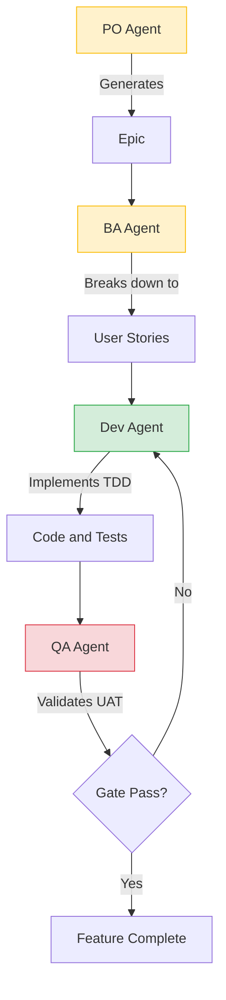

# The new way of developing Apps: Utilising AI (Gemini CLI) in modernizing legacy applications - Chapter 5: Innovation Unleashed (AI Integration & BMAD)

In [Chapter 4](./chapter4.md), we successfully transitioned our legacy monolith into a modern, decoupled Spring Boot application. By working in partnership with the **Gemini CLI agent**, we achieved a 80% reduction in modernization time, creating a stable foundation with a clean Controller-Service-Repository architecture. 

Now, we reach the final and most exciting chapter of our journey—the home stretch: **Innovation**. With the technical debt of the past cleared, we are no longer just "keeping the lights on." We are now building the future of our shopping cart application by integrating advanced AI capabilities.

## The Foundation: Why Modernization Mattered

Before we dive into the AI features, it’s important to understand *why* the modernization journey described in [Chapter 4](./chapter4.md) was the prerequisite for this success. In the original legacy monolith, business logic was tangled inside JSPs and Servlets. Adding AI would have required "hacking" into a fragile codebase.

As described in our **modernized architecture**, we decoupled the application into clear layers:
- **RESTful APIs:** The backend now communicates via standard JSON endpoints.
- **Service Layer:** Business logic is isolated and easily testable.
- **Repository Layer:** Data access is abstracted via Spring Data JPA.

This "AI-Ready" architecture meant that we could treat AI integration as just another service. Instead of days of refactoring, adding a new intelligent feature became a matter of **hours, not days**.

## Orchestrating Success: The BMAD METHOD

To implement these new features, we moved beyond single-agent interactions and adopted the **BMAD METHOD**. This approach mimics a real-world Software Development Life Cycle (SDLC) by assigning specific roles to different AI agents.

By giving agents distinct personas and workflows, we ensure they perform tasks within a predefined scope, minimizing "hallucination" and maintaining high engineering standards.

### The BMAD Roles:
- **Product Owner (PO):** Defines the vision and generates the high-level Epic.
- **Business Analyst (BA):** Breaks down the Epic into detailed User Stories.
- **Scrum Master (SM):** Manages the backlog and ensures process adherence.
- **Developer (Dev):** Implements the code using **Test-Driven Development (TDD)**, ensuring full unit and integration test coverage.
- **QA Engineer:** Implements User Acceptance Tests (UAT) and performs final validation.

### The Agile Agent Workflow:

1.  **Epic Generation:** The PO agent analyzes the project and generates a new Epic (e.g., "AI-Powered Shopping Assistant").
2.  **Story Decomposition:** The BA agent breaks the Epic into actionable stories with clear acceptance criteria.
3.  **Implementation:** The Developer agent implements the stories, strictly following TDD principles.
4.  **UAT & Gating:** The QA agent validates the implementation. If a "Gate" fails (e.g., a test fails or a requirement isn't met), the story is routed back to the previous agent for correction.

## AI Capability 1: Enhanced Product Intelligence

Our first innovation was to transform the static Product Details page into an interactive intelligence hub. 

**The Goal:** Provide users with additional product information pulled from guarded data sources, including moderated public reviews, to help them make informed decisions.

**The Process:**
Following the BMAD workflow, the PO generated the epic, and the BA created stories focused on "External Data Retrieval" and "Sentiment Analysis." The Developer agent then implemented a service that calls the Gemini API to search for and summarize moderated public sentiment about a product.

### Senior Architect Intervention: The "Content Overflow" Challenge
Even with clear stories, the AI agents can sometimes over-perform. In this case, the agent initially pulled in massive amounts of external data that exceeded the layout of the Product Details page. 
**The Intervention:** A senior architect stepped in to instruct the agent to:
1.  **Shorten the summary** to a maximum of 5 bullet points.
2.  **Filter negative sentiment** information that might be irrelevant or overly biased, ensuring a high-quality, professional user experience.

## AI Capability 2: The Intent-Aware Chatbot

Our second innovation was the crown jewel of the project: a fully integrated **AI Chatbot**.

**The Goal:** An assistant that understands natural language, derives user intent, constructs database queries, and returns human-like responses.

**The Process:**
Because of our modernized, decoupled architecture, the implementation was incredibly fast. The agent used our existing REST APIs as "tools" it could invoke.
- **User:** "Find me red running shoes under $100."
- **AI Chatbot:** Derives intent (Search), constructs the SQL query via the Repository layer, and returns the formatted results.

### Senior Architect Intervention: Intent vs. Synthesis
In an early iteration, the agent attempted a "non-AI" approach by simply performing string synthesis of the input query (looking for keywords). 
**The Intervention:** We specifically instructed the agent to **invoke the Gemini API backend** to truly analyze the semantics of the user's message. This enabled the chatbot to understand complex requests like "What did I buy last month that was blue?"—a feat impossible with simple string matching.

## The Revolutionary Result

Thanks to the partnership between the **Gemini CLI agent** and a senior developer, the entire implementation of the AI Chatbot took **just a few hours**. In a traditional legacy environment, this would have taken weeks of architectural research and refactoring.

## Conclusion: A New Era of Engineering

The journey from a "black box" legacy monolith to an AI-powered modern application has been transformative. GenAI agents like **Gemini CLI** are not just tools; they are revolutionizing the entire development lifecycle:
1.  **Analysis:** Helping us understand and document decades-old code.
2.  **Migration:** Automating the heavy lifting of lift-and-shift.
3.  **Modernization:** Rewriting and refactoring into modern, scalable architectures.
4.  **Innovation:** Implementing cutting-edge AI features at record speed.

However, the most important lesson we learned is that **the human element remains indispensable**. An experienced developer or architect is crucial to ensure the **feasibility, quality, and security** of the project. The AI provides the speed and the power, but the human provides the direction, the guardrails, and the final seal of quality.

Modernization is no longer a burden; it is an invitation to innovate. With Gemini CLI and the BMAD method, the path from legacy to legendary is shorter than ever before.

---
*Thank you for following our journey. Now, it's your turn to modernize!*
